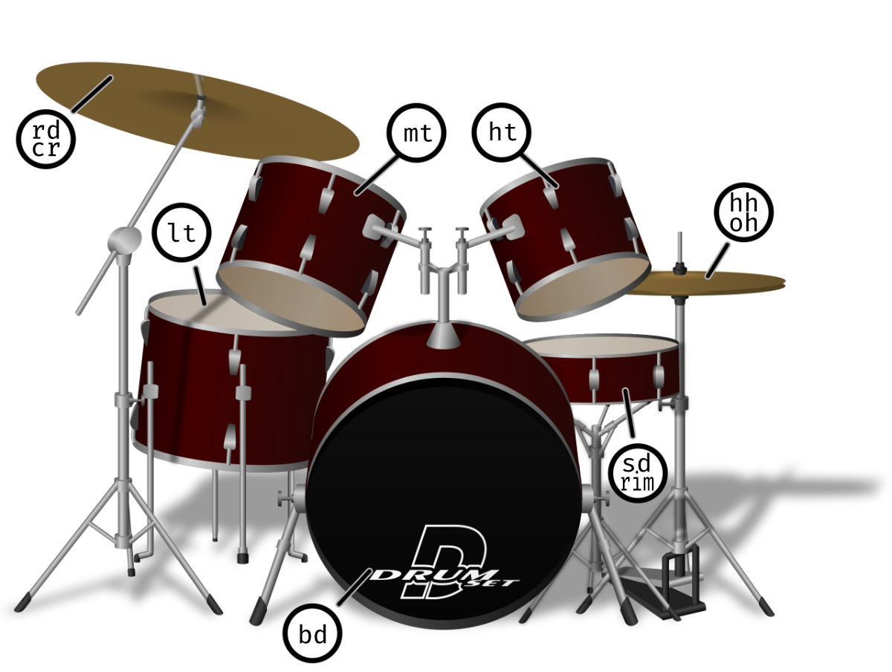
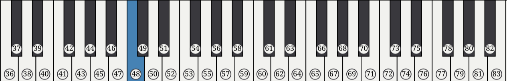
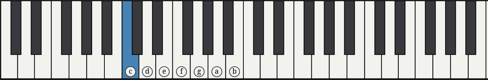
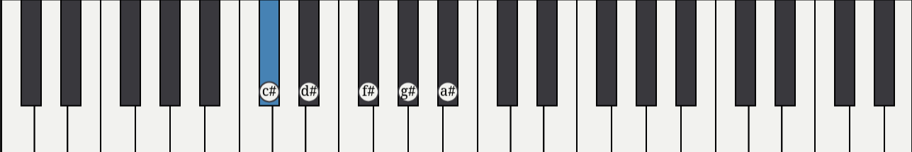
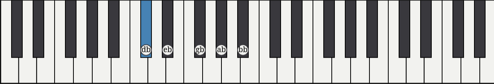

+++
title = "Atelier Strudel"
weight = 3
+++

> [!info] 
Pour mieu comprendre les notions du live coding, nous allons utiliser Strudel

### Qu'est-ce que Strudel
Strudel est un site qui permet d'utiliser le Tidal Cycles de JavaScript. 
C'est une branche du Javascript qui va permettre d'exploiter le live coding.

### Objectif ?
Comprendre le fonctionnement de Strudel, les différents types de sons et rythmes possibles.

<hr/>

#### Première note sur Strudel
Rendez vous sur Strudel : https://strudel.cc/#c291bmQoIm1ldGFsIik%3D

Par la suite, vous pourrez choisir entre appuyer sur le bouton play ou faire la commande : Ctrl + enter <br />
Pour arrêter, vous pouvez  appuyer sur stop ou faire la commande : Ctrl + .

```JavaScript
sound("metal")
```

Vous pouvez vous amuser à essayer plusieurs sons différents, comme : jazz, casio, wind, insects

#### Changer l'échantillon d'un son

Allez sur Strudel et entrez cette ligne :

```JavaScript
sound("numbers")
```

Le son émit est un : zero.<br/>
N'y aurait-il pas d'autres numéros à utiliser ? Et oui !<br />
Chaque son a plusieurs échantillons différents.
Par défaut, l'échantillon sélectionné est 0 (numbers:0), mais pour jouer le son : one, il va falloir écrire :
 
```JavaScript
sound("numbers:1")
```

Vous pouvez tester ça avec différents sons :

```JavaScript
sound("metal:2")
```

#### Utiliser un set de batterie

Les sons de batterie de Strudel se répartissent comme suit : 




Chaque acronyme représente un son distinct sur une batterie :


| Acronyme           | Définition | 
|--------------------|------------|
| `bd`        | bass drum    | 
| `sd`    | snare drum     | 
| `rim`  | rimshot    | 
| `hh`        | hihat     |
| `oh`          | open hihat     | 
| `lt`  | low tom    | 
| `mt`  | middle tom    | 
| `ht`  | high tom    |
| `rd`  | ride cymbal    | 
| `cr`  | crash cymbal    |

<br />
Vous pouvez jouer une combinaison de ces sons en laissant des espaces entre chaque acronyme :

```JavaScript
sound("bd hh bd sd")
```
Vous pouvez aussi changer l'échantillon des sons avec des librairies différentes.<br />
Par exemple :

```JavaScript
sound("bd hh bd sd").bank("ViscoSpaceDrum")
```
Voici des exemples d'autres banques de sons pour la batterie :

- alesishr16
- d70
- emusp12
- korgm1
- rolandcompurhythm1000
- sp12
- yamaharm50
- spacedrum
- ry30

#### Changer le tempo

Pour l'instant, chaque note se joue avec un rythme assez lent, pour le rendre plus rapide on va devoir modifier le cpm (cycles par minutes).<br />
Pour ce faire, on va utiliser la commande setcpm() :

```JavaScript
setcpm(250/4)
sound("bd hh bd sd").bank("ry30")
```

Plus on va ajouter de notes à notre séquence et plus celle-ci va jouer vite :

```JavaScript
setcpm(250/4)
sound("bd rim hh sd rim sd hh").bank("spacedrum")
```

On peut aussi ajouter des pauses dans notre séquence en ajoutant '-' ou '~' :


```JavaScript
setcpm(250/4)
sound("bd sd - bd - sd").bank("rolandcompurhythm1000")
```

On peut aussi jouer des notes beaucoup plus vite avec des crochets :

```JavaScript
setcpm(250/4)
sound("bd rim hh sd [rim sd] hh").bank("rolandcompurhythm1000")
```

Ainsi, qu'en multipliant la note :

```JavaScript
setcpm(250/4)
sound("bd*2 rim hh sd rim sd*2 hh").bank("rolandcompurhythm1000")
```

On peut aussi jouer plusieurs fois la meme séquence en utilisant des crochets et de la multiplication :

```JavaScript
setcpm(250/4)
sound("bd rim hh sd [rim sd]*2 hh").bank("rolandcompurhythm1000")
```

#### Jouer des notes

Avec Strudel, nous pouvons jouer des notes à l'aide des notes du piano.<br/>
Il y a 2 facons de jouer des notes. La première est d'utiliser le numéro des touches du piano.

Par exemple :

```JavaScript
note("48 52 55 59").sound("piano")
```


Ou sinon, avec des lettres (nom des notes en anglais) :

```JavaScript
note("c e g b").sound("piano")
```




Pour jouer les dièses et les bémols, on pourra utiliser # et b :
```JavaScript
note("d f# a b").sound("piano")
```


```JavaScript
note("eb g bb d").sound("piano")
```



Comme vous l'avez peut-être remarqué dans l'exemple précédent, la dernière note était une octave plus basse que ce qu'on se serait attendu ce qui rend le son assez triste.
Pour y remédier, nous pouvons utiliser les octaves (de 1 à 8) pour jouer les notes dans l'octave qui nous plait :

```JavaScript
note("eb g bb d4").sound("piano")
```
>Veuillez noter que l'octave de base est 3, il n'est donc pas nécessaire de l'écrire à chaque fois.


#### Jouer plusieurs sons en même temps ou alternativement

Afin de jouer plusieurs sons en simultanés, on peut séparer les sons par des virgules (,):

```JavaScript
note("eb, g, bb, d4").sound("piano")
```
>Ici, on vient de jouer un accord de Do mineur 7ieme ou Cm7


On peut aussi alterner entre des notes simultanées et seules :

```JavaScript
note("eb g [bb, d4]").sound("piano")
```

On peut aussi jouer plusieurs sons différents en même temps:

```JavaScript
note("eb, g, bb, d4").sound("piano, gm_fx_crystal")
```

Mais aussi alternativement :
```JavaScript
note("eb g [bb, d4]").sound("piano gm_acoustic_bass")
```


#### Changer la taille des notes :

Pour ralentir une séquence on peut les diviser :
```JavaScript
note("[c4 e4 g4 b4]/4").sound("gm_music_box")
```

Pour allonger une note en particulier, on peut utiliser @, puis ajouter la taille de la note qu'on veut :
```JavaScript
note("c4@2 e4 g4@2 b4").sound("gm_flute")
```

Pour jouer une notre par cycle, on peut utiliser les < ... > :
```JavaScript
note("<c4 e4 g4 b4>").sound("gm_music_box")
```

Les < ... > peuvent aussi nous servir, afin d'aterler les notes :
```JavaScript
note("d <f# a c#4>").sound("gm_epiano1")
```

#### Jouer des gammes

Afin de trouver les notes qui se marient le mieu avec notre gamme, on peut utiliser la fonction scale() :

```JavaScript
note("2 4 5 [7,9]*2").scale("C:major").sound("piano")
```
> [!tip]- Essayez de changer la gamme par :
> C:minor,d:dorian, A:major, F:major:pentatonic, G:mixolydian

On peut aussi alterner entre plusieurs gammes :
```JavaScript
note("2 4 <5,7> 3*2").scale("F:major:pentatonic A:major").sound("piano")
```

#### Exemples avec ce qu'on vient de voir :
> Pouvez vous trouver d'où vient ces chansons ?

```JavaScript
setcpm(30/4)
note("a3 c#4 a4 b4 c#5 b4 a4 e4 d4 f#4 c#5 e5 c#5 a4@2").sound("piano")
```
```JavaScript
setcpm(100/4)
$:note("[e4,g#4,b4]!2 [[e4,g#4,b4] g#4] [g#4,b4,e5]").sound("piano")
$:note("[e@.5 b@.5]!3 e").sound("piano")
```
> [!tip]- Pour jouer les mêmes notes plusieurs fois on utilises le : !

#### Exemple plus complexe : 

```JavaScript
$:note("eb, g, bb, d4 <[f, ab, c, eb4] [-]>").sound("piano, gm_fx_crystal")
$:sound("bd*4, [~ sd]*2, [rim ~ <mt ht>]*4")
.bank("rm50")
```

L'atelier est inspiré du site de Strudel. <br />Pour plus d'exemples et d'informations, visitez :
https://strudel.cc/workshop/first-sounds/
