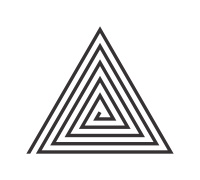
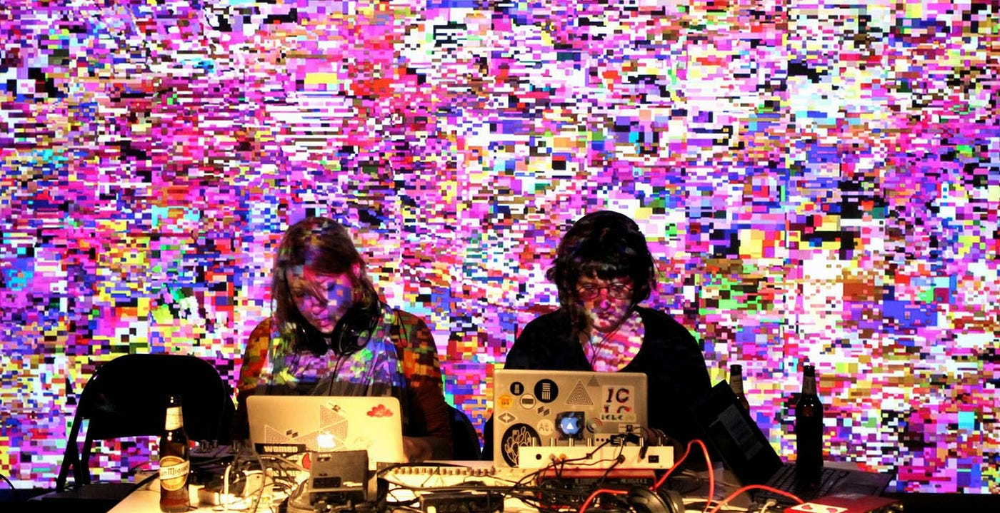
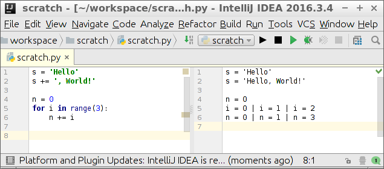
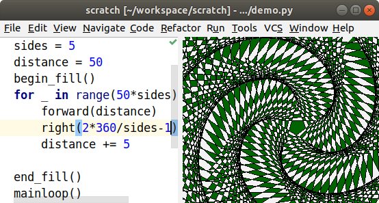
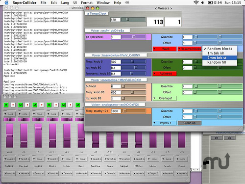
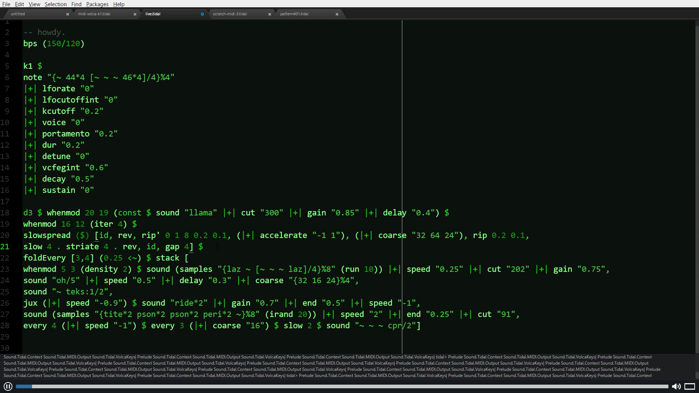
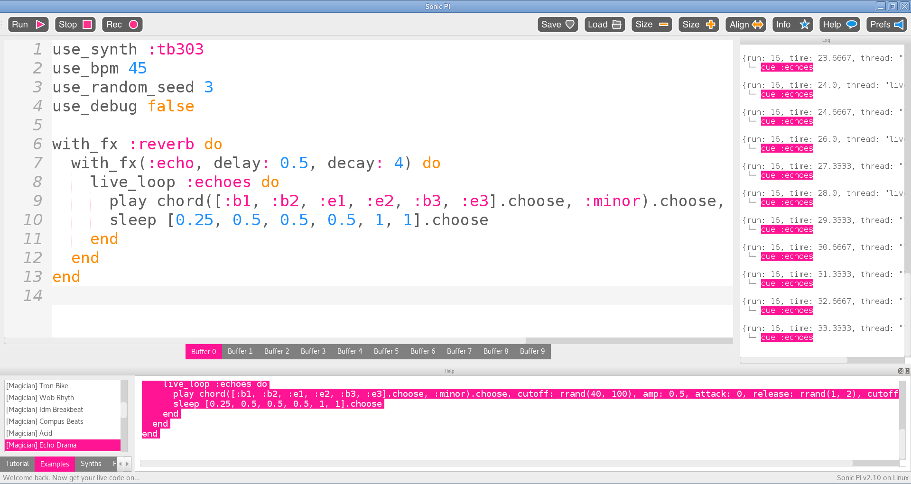

+++
title = "Notes de cours"
weight = 2
+++

## Le Live Coding, c'est quoi ? 
Le live coding, à défaut d'être un langage de programmation en soi, est surtout un concept. En effet, il s'agit de coder quelque chose en live devant un public. C'est une manière de prouver ses capacités en informatique aux gens présents. Cela pourrait se faire dans une compétition ou dans une « Algorave ».

### L'histoire du live coding
Le concept du live coding est née en 1970, principalement par la culture de la programmation interactive en temps réel. Le concept était née sous le désir de vouloir écrire quelque chose et d'avoir la réaction de son code en temps réel.

Dans les débuts de la programmation, des environnements de programmation tel que : Lisp machines, Logo, Hypercard et Smalltalk permettaient cette possibilité de «live». 

De ce principie est née le concept de <b>Vivacité</b>.

#### Les quatres degrées de la vivacité
Selon Steve Tanimoto, la vivacité est le degré avec lequel on peut intéragir avec un programme et ils les décrit comme suit :

<b>Niveau 1 :</b> Aucun retour sémantique sur un programme n'est fourni

<b>Niveau 2 :</b> Un retour sémantique est disponible à la demande sur un composant sélectionné. Par exemple, la saisie d'une expression dans un interpréteur démontre une disponibilité de niveau 2.

<b>Niveau 3 :</b> Un retour sémantique incrémentiel est automatiquement fourni lors de chaque modification incrémentielle du programme. Par exemple, une feuille de calcul prend en charge le niveau 3 de vivacité.

<b>Niveau 4 :</b> En plus du niveau 3, un retour sémantique incrémentiel est automatiquement fourni pour d'autres événements de données tels que les clics de souris ou les exceptions.

### Les Algoraves
Durant des évènements, des gens vont se rassembler pour coder un ensemble d'éléments graphiques et musicales en « live », afin de créer une ambiance pour un public ou d'agrémenter une soirée entre amis. Ces genres de rassemblement s'appelent des « algoraves » et sont de gros évènements qui rassemblent beaucoup de gens à chaque année. 

>Logo officiel des Algoraves

Le concept d'Algorave a premièrement été popularisé par le collectif international TOPLAP dans les alentours de 2012. Le phénomèneme d'Algorave est surtout l'épitome du live coding qui lui est présent depuis 1970, mais seulement en échelle beaucoup moins large. Par la suite, une mutlitude de groupes ont fait leur appartition et se présentent, depuis, devant des gens enthousiastes. Beaucoup comparent le live coding à une prestation d'artistes en live, tel qu'un peintre ou un musicien qui offre une performance, pendant que le public observe. 

Un des avantages des Algoraves et de l'utilisation du live coding, est que le public présent peut donner des rétroactions sur le moment, afin de suggérer de nouvelles pistes à l'artiste sur scène. Celui-ci pourra par la suite ajouter les suggestions du public dans son code et créer un plus grand sentiment de proximité entre lui et son public.

### Déroulement d'une scéance de live coding
Pour débuter une scéance de live coding, l'artiste va dabord commencer par utiliser un nouveau document ou un bout de code déjà existant. L'écran du prestataire sera projeté dans la salle, afin que le public puisse voir le code se faire écrire sur le moment. 

Lors de l'écriture du code, le prestataire va par la suite expliquer un peu son résonnement et le code qu'il écrit aux personnes présentes. Celui-ci expliquera aussi les problèmes rencontrés et les approches utilisés pour les résoudres.

### Les différentes formes du live coding
Le live coding peut prendre plusieurs formes dépendament de l'effet recherché par le prestataire. Il y a 2 branches principales du live coding, la première est plus axé sur un concept éducatif et technique et l'autre est plus axé sur le coté créatif.

#### Le live coding dans l'éducation
Dans un contexte éducatif, le live coding va permettre aux gens de régler des problèmes en live, permettant, ainsi d'expliquer le fil de pensées et la logique utilisé dans leur code. 
On peut aussi utiliser cet aspect du live coding, afin de faire des compétitions de résolution de problèmes dans lesquels des participants vont s'affronter pour résoudre les problèmes le plus efficacement/le plus rapidement.

#### Le live coding créatif
Dans un contexte plus créatif, on va pouvoir utiliser le live coding pour coder des éléments graphique et sonores, permettant, ainsi de développer sa créativité et de sortir des sentiers battus de normes de la musique et du graphisme dans le but de créer des médias beaucoup plus numérique qu'à la normale. 

### Les langages de programation utilisés pour le live coding créatif
À cause de la montée en popularité du live coding, plusieurs frameworks ont été produits pour répondre à ce besoin naissant. De manière générale, les frameworks conçus sont plutôt orientés vers le coté créatif du live coding. Ces frameworks dérivent de langages de programmation assez connus, tel que : JavaScript, Python, Haskell et Ruby. 

### Les logiciels nées pour le live coding
Pour remplir les besoins des développeurs émergeants en live coding, plusieurs personnes se sont penchés sur la production de plusieurs logiciels, afin de concevoir les meilleurs frameworks, en voici quelques uns :

#### SuperCollider
SuperColider est un logiciel pour la composition algorithmique de sons. Il implémente un moteur audio convertit en serveur qui permet de recevoir un langage de programation qui agit comme client, ainsi qu'un éditeur intégré d'un système d'aide.

#### TidalCycles
Tidal Cycles est un environnement open source qui permet de coder des modèles d'algorithmes.
Celui-ci est écrit en Haskell et utilise SuperCollider pour gérer la synthèse audio MIDI.
Ce logiciel a inspiré plusieurs autres logiciels et sites webs. 
Tidal Cycles a été développé par Alex McLean, lorsqu'il était en train d'étudier pour son BAC à l'université de Goldsmiths à Londre. Son projet avait dabord commencé en 2006 par un DSL qui explorait les motifs de rotations, puis a ensuite été approfondis en 2007(jusqu'à 2011) pour un système plus créatif qui permettait d'analyser les continuations rythmiques dans la poésie. Jusqu'à finalement atteindre sa forme finale vers 2015 et continue d'être mis à jour jusqu'à présent.

#### Sonic Pi
Sonic Pi est un environnement de développement open source dérivé du Rubby.Les gens l'utilisent pour les Algoraves, grâce à sa précision rythmique. Celui-ci avait initialement été développé pour supporter les cours de musique à l'école. Sonic Pi a été développé par Sam Aaron, qui était supporté par l'Université de Cambrige Computer Laboratory en collaboration avec Raspberry Pi Foundations. Celui-ci est maintenant indépendant et survis grâce aux donations des utilisateurs.

### Conclusion
Le live coding est un concept beaucoup plus large qu'on pourrait s'imaginer et son origine date d'il y a presque 60 ans. Grâce au live coding, un nouveau mouvement a pu voir le jour : l'Algorave. Un mouvement de groupe, qui permet de rassembler les gens et de les unirs dans une passion commune qui est : la programmation. 
Dans le live coding, on retrouve aussi 2 branches distinctes : l'éducation et la créativité.
D'un coté, on peut résoudre des problèmes et mieu les expliquer et de l'autre on peut utiliser notre créativité pour produire des nouveaux éléments graphiques et sonores.
De ce fait, plusieurs personnes se sont mises en oeuvre pour produire des frameworks/logiciels qui permettent aux développeurs (et aux nouveaux !) de pouvoir utiliser les concepts de live coding. Quelques exemples de ces logiciels sont : SuperCollider, TidalCycles et Sonic Pi. 

En somme, le live coding est une technologie émergente qui ne cesse de grandir et de trouver un nouveau public qui lui est propre. Cette technologie permet de rassembler les gens par leur passions communes et je trouve qu'il n'y a rien de plus beau dans l'informatique que de rassembler des gens adeptent des mêmes choses et qui ensemble peuvent développer des projets encore plus complexes.

### Sources
- https://liveprogramming.github.io/liveblog/2013/01/a-history-of-live-programming/
- https://fr.wikipedia.org/wiki/Live_coding
- https://medium.com/@royce.taylor789/live-coding-6ac7ead9dbcf 
- https://livecoding.fr/
- https://slab.org/2013/06/20/what-on-earth-is-live-coding/
- https://responsivedreams.com/about/what-is-live-coding
- https://supercollider.github.io/
- https://tidalcycles.org/
- https://en.wikipedia.org/wiki/Sonic_Pi
